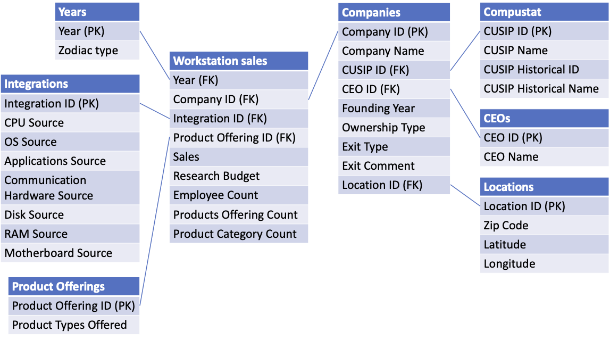
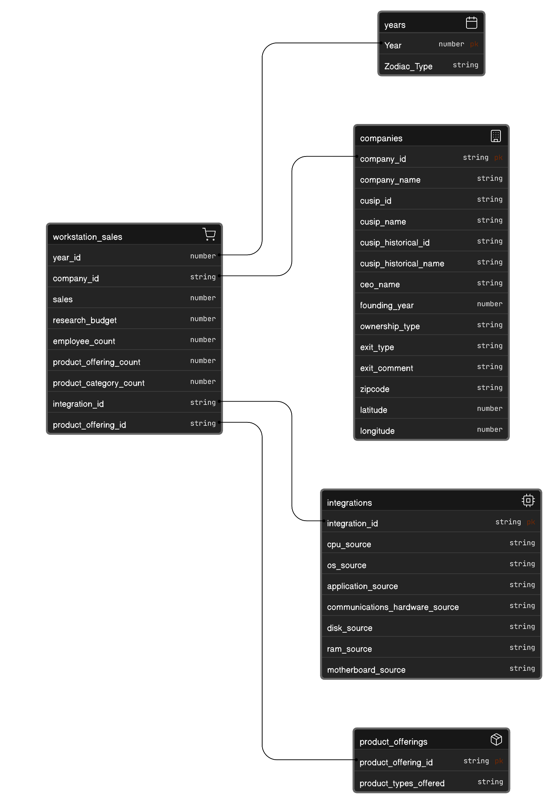

# Data Modeling Project - Workstation Sales Analysis

## Project Overview
This project implements both snowflake and star schema data models for analyzing workstation sales data. The models are built using DuckDB and Python, focusing on computer workstation sales data with various company and product attributes.

## Technologies Used
- Python
- DuckDB 
- Pandas
- Jupyter Notebook

## Data Models
The project implements two types of dimensional models:

### 1. Snowflake Schema


Fact Table:
- `workstation_sales` (contains sales metrics)

Dimension Tables:
- `companies`
- `compustat`
- `ceos`
- `locations` 
- `product_offerings`
- `integrations`
- `years`

### 2. Star Schema


Tables:
- `companies` (denormalized dimension combining multiple attributes)
- `workstation_sales` (fact table)

## Key Features
- Data cleaning and transformation
- Implementation of both snowflake and star schemas
- Custom data type handling (e.g., ZIP codes)
- Geographic data management (latitude/longitude)
- Integration of Chinese zodiac calendar
- Comprehensive product categorization

## Setup and Usage

1. Install required packages:
```python
pip install duckdb pandas
```

2. Run the Jupyter notebook:
```bash
jupyter notebook "Data Modeling Project.ipynb"
```

## Data Structure
The source data comes from two CSV files:
- `SorensonworkfirmFIVEdata.csv`
- `SorensonworkprodFIVEdata.csv`

## Project Structure
```
├── Data Modeling Project.ipynb
├── dim-model.db
├── ERD.png
├── snow.png
├── SorensonworkfirmFIVEdata.csv
├── SorensonworkprodFIVEdata.csv
├── star_schema.png
└── star.png
```

## Entity Relationship Diagrams
- ERD diagrams are included in the repository
- Both snowflake and star schema visualizations are provided

## Analysis Capabilities
The models support various analyses including:
- Sales performance by location
- Product offering analysis
- Company performance metrics
- Integration patterns
- Historical trends